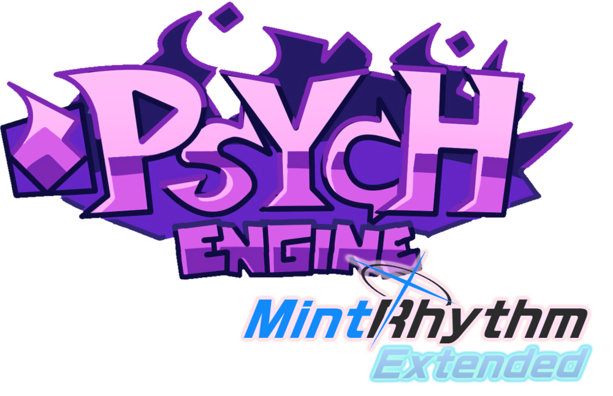

to be updated

# Friday Night Funkin' - MintRhythm Engine

Based on **Psych Engine Mobile** (commit [`d5f4522`](https://github.com/kittycathy233/FNF-MintRhythm-Engine/commit/d5f452261faa32cf71b00ba6f7908d134e7e8c8e)), this engine integrates inspiration from [Funk Archive](https://gamebanana.com/mods/496238) and features tailored for [Blue Archive](https://en.wikipedia.org/wiki/Blue_Archive) players, including a user-friendly UI and enhancements from other Psych Engine branches.

> PsychEngine originally used in the [Mind Games Mod](https://gamebanana.com/mods/301107), designed to fix vanilla issues while preserving casual gameplay. Aimed at providing an accessible alternative for new developers.

---

## 🔧 Customization
To disable features like *Lua Scripts* or *Video Cutscenes*:
1. Open `Project.xml`
2. Locate the target variables (e.g., `VIDEOS_ALLOWED`, `LUA_ALLOWED`)
3. **Delete the line** or **comment it out** using XML syntax:  
   `<!-- YOUR_LINE_HERE -->`

---

## 📚 Softcoding (.lua/.hx)
Refer to the official documentation:  
[Psych Engine Lua Scripting Wiki](https://shadowmario.github.io/psychengine.lua)

---

## ✨ Features  
See detailed changes in the base engine repository:  
[Psych Engine Features](https://github.com/ShadowMario/FNF-PsychEngine)

---

## 💖 Credits
### MintRhythm Team
| Role              | Contributor          |
|-------------------|----------------------|
| Project Lead      | [KittyCathy](https://github.com/kittycathy233) |

### Special Thanks
- Engines:  
  [NovaFlare Engine](https://github.com/NovaFlare-Engine-Concentration/FNF-NovaFlare-Engine)・
  [OS Engine](https://github.com/notweuz/FNF-OSEngine)・
  [Slush Engine](https://github.com/Slushi-Github/Slushi-Engine)・
  [JS Engine](https://github.com/JordanSantiagoYT/FNF-JS-Engine)・
  [Kade Engine](https://github.com/KadeArchive/Kade-Engine)
- Blue Archive:  
  [JP](https://bluearchive.jp/)・
  [Global](https://bluearchive.nexon.com)・
  [CN](https://bluearchive-cn.com/)  
- Tools:  
  [Kimi](https://kimi.moonshot.cn/)・
  [DeepSeek](https://www.deepseek.com/)

北狐我喜欢你

---

### Psych Engine Mobile Team
| Role              | Contributor |
|-------------------|-------------|
| Head Porter       | Homura      |
| Assistant Porter  | Karim       |
| Project Helper    | Moxie       |

### Core Psych Engine Team
| Role                     | Contributor      |
|--------------------------|------------------|
| Lead Developer           | Shadow Mario     |
| Lead Artist/Animator     | Riveren          |

#### Extended Thanks
- bbpanzu (Ex-Programmer)
- crowplexus (HScript Iris, Input System v3)
- Kamizeta (Mascot Designer)
- MaxNeton (Loading Screen Art)
- Keoiki (Note Splash Animations)
- SqirraRNG (Crash Handler)
- EliteMasterEric (Shaders)
- MAJigsaw77 (MP4 Video Loader)
- iFlicky (Music/SFX)
- KadeDev (Chart Editor Fixes)
- superpowers04 (LUA JIT)
- CheemsAndFriends (FlxAnimate)
- Ezhalt (Mascot Jingle)
- MaliciousBunny (Final Update Video)

---

> Engine by **ShadowMario**・Game by **ninjamuffin99**